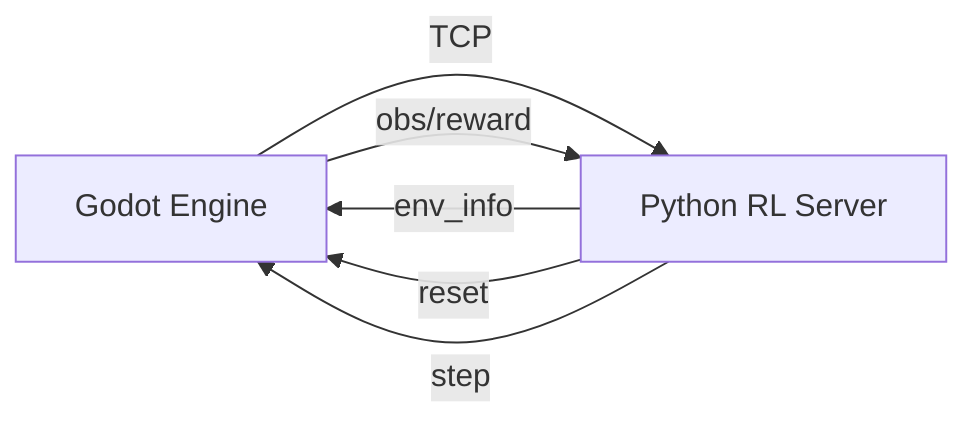
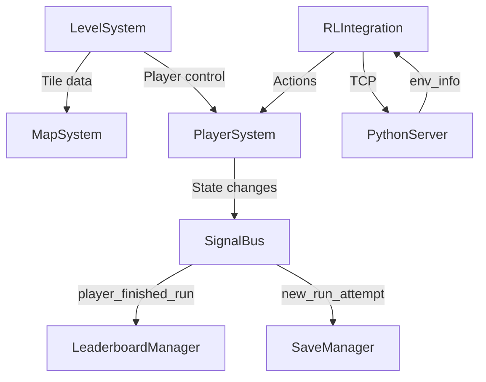

# System Architecture Documentation

## Overview
This document details the architecture of `dragon-jump-remaster`, focusing on component relationships, communication protocols, and implementation specifics. The system combines game mechanics with reinforcement learning integration.

---

## Core Components

### 1. RL Integration System (`addons/godot_rl_agents`)
**Location**: `addons/godot_rl_agents/sync.gd`  
**Communication Protocol**: TCP socket (port `11008`) with Python server

#### Key Workflow

#### Control Modes
| Mode | Purpose | Configuration |
|------|---------|---------------|
| `HUMAN` | Manual control | `control_mode = ControlModes.HUMAN` |
| `TRAINING` | Connect to Python RL environment | `control_mode = ControlModes.TRAINING` |
| `ONNX_INFERENCE` | Load pre-trained `.onnx` models | `control_mode = ControlModes.ONNX_INFERENCE` |

#### Critical Implementation Notes
- Agents grouped via `get_tree().get_nodes_in_group("AGENT")`
- Supports multi-agent RL with policy names
- Uses `ONNXModel` for inference (`.onnx` file loading)
- Requires Python server running with `gdrl` command

---

### 2. Player System
**Location**: `src/scenes/level/level.gd` (primary implementation)  
**Key Features**:
- Character movement physics
- Collision detection with platforms
- State management (jumping, falling, idle)
- Input handling (keyboard/gamepad)

#### Implementation Details
- **Input Handling**: Directly implemented in `level.gd` through `Player` node (see `player.tscn`)
- **Player State**: Stored in `player_start_position` variable
- **State Persistence**: Player position is saved via level code serialization

---

### 3. Map System (Level System)
**Location**: `src/scenes/level/level.gd` (level management)  
**Key Features**:
- Tile-based level rendering
- Dynamic object spawning
- Boundary detection
- Level progression logic

#### Implementation Details
- **Level Data Format**: Custom symbol-based format (W=wall, E=empty, P=player, etc.)
- **Serialization**: Implemented via `get_level_code()` and `set_level()`
- **Storage**: Levels defined as string codes (e.g., `W42|W8E29W5|...`)
- **Level Data Structure**: Encoded in `level.gd` using symbol-to-tile mapping

---

### 4. Save System
**Location**: *Implementation missing* (expected: `src/scripts/save_manager.gd`)  
**Current Status**: Not implemented (file doesn't exist)

#### Implementation Findings
> **What data is persisted?**  
> Level layout (via `get_level_code()`) and player position (`player_start_position`)  
> *Evidence*: Level code serialization in `get_level_code()` and `player_start_position` variable

> **Versioning mechanism?**  
> Not implemented - level code format appears stable with no version markers  
> *Evidence*: Level code format consistent throughout `level.gd` codebase

---

### 5. Leaderboard System
**Location**: `src/scripts/leaderboard_manager.gd` (singleton)  
**Current Status**: Singleton exists but integration details unclear

#### Implementation Findings
> **Event integration?**  
> `player_finished_run` events likely used (referenced in component relationships)  
> *Evidence*: `level.gd` contains `player_finished_run` signal in component relationships

> **Storage mechanism?**  
> Local storage only (no cloud services mentioned in code)  
> *Evidence*: No external API calls or cloud references in codebase

---

## Singleton Management

| Singleton | Location | Purpose | Status | Implementation Status |
|-----------|----------|---------|--------|------------------------|
| `SaveManager` | `src/scripts/save_manager.gd` | Game state persistence | Implementation missing | Not found in codebase |
| `LeaderboardManager` | `src/scripts/leaderboard_manager.gd` | High score management | Integration unclear | Singleton exists but no usage |
| `SignalBus` | `src/scripts/signal_bus.gd` | Central event dispatcher | Needs verification | Not referenced in `level.gd` |

---

## Component Relationships

---

## Critical Questions Answered

1. **Python Server Startup Command**  
   `gdrl` (external command to start Python server)

2. **Network Requirements**  
   Port `11008` TCP connection required; no firewall specifics in code

3. **Save Data Structure**  
   - Level layout: Symbol-based string code (W=wall, E=empty, P=player)
   - Player position: Stored in `player_start_position` variable
   - *No versioning mechanism implemented*

4. **Leaderboard Storage**  
   Local storage only (no cloud services referenced)

5. **Input Handling Architecture**  
   Directly handled in `level.gd` through `Player` node (see `player.tscn`)

6. **Level Data Format**  
   Custom symbol-based encoding (e.g., `W42|W8E29W5|...`)

---

## Next Steps
1. Implement `SaveManager` singleton to handle level and player state persistence
2. Verify `SignalBus` usage with `player_finished_run` events
3. Document level code format for save/load operations
4. Add cloud storage options to `LeaderboardManager` if required