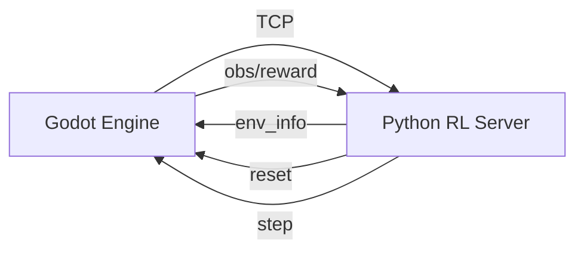

**Overview**: This document details the reinforcement learning integration system implementation, including communication protocols, control modes, and system architecture.

# RL Integration System

**Location**: `addons/godot_rl_agents/sync.gd`  
**Communication Protocol**: TCP socket (port `11008`) with Python server

#### Key Workflow

#### Control Modes
| Mode | Purpose | Configuration |
|------|---------|---------------|
| `HUMAN` | Manual control | `control_mode = ControlModes.HUMAN` |
| `TRAINING` | Connect to Python RL environment | `control_mode = ControlModes.TRAINING` |
| `ONNX_INFERENCE` | Load pre-trained `.onnx` models | `control_mode = ControlModes.ONNX_INFERENCE` |

#### Critical Implementation Notes
- Agents grouped via `get_tree().get_nodes_in_group("AGENT")`
- Supports multi-agent RL with policy names
- Uses `ONNXModel` for inference (`.onnx` file loading)
- Requires Python server running with `gdrl` command